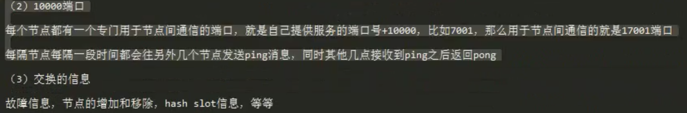

# 分布式一致性算法

## 1. Paxos

## 2. Hash算法

## 3. Lease租约机制

## 4. Raft

### 1. Leader选举

三个角色

- Leader    主节点，领导者
- follower  跟随者
- Candidate 候选者 

term 任期 默认是0
timeout 选举超时

流程

- 默认集群中所有到节点角色均为 follower；
- 每个节点都有一个随机定时器 150～300ms，哪个节点定时器先达到，就会置为 Candidate 角色，并设置term为1；
- 然后被置为 Candidate 角色的节点就发送投票信息到集群中其它到节点，如果得到大多数节点同意 (默认会给自已投上一票)，那么它就为 Leader 角色；
  其它节点会更改自已的 term为1；
- 持续Leader 发送心跳给 follower；

### 2. 日志复制

Leader节点统一对日志进行复制，然后发送日志到其它到集群节点上并应用日志。 

流程

- 客户端发送 set 5
- 集群中Leader角色接收到后，首先更改节点日志中到条目，但并未提交，因此不会更新节点到值；
- 下次发送心跳时，把未提交到日志条目一同发送到其它节点，其它节点也同理在本地节点日志中追加；
- Leader角色等待 直到接收到大多数节点心跳返回后，才会更新节点到值，并告诉其它集群节点已提交，这样集群到数据就保持一致啦
- Leader角色返回给客户端

### 3. 参考

https://www.bilibili.com/video/BV1Ev411t7jh?from=search&seid=12343138956468781519

raft 动画
https://github.com/klboke/raft-animation
http://thesecretlivesofdata.com/raft/
http://www.kailing.pub/raft/index.html

## 5. Gossip(最终一致性)

### 1. 最终一致性

实现最终一致性的三种方式

直接邮寄（Direct Mail）、反熵（Anti-entropy）和谣言传播（Rumor mongering）是实现最终一致性的常用三种方法。

https://blog.csdn.net/qq_44961149/article/details/115398350

### 2. 分布式中集群节点通信协议

主要有两种

第一种：集中式管理，比如 Zookeeper

第二种：Gossip 协议，比如Redis cluster, Consul

### 3. 通信原理

