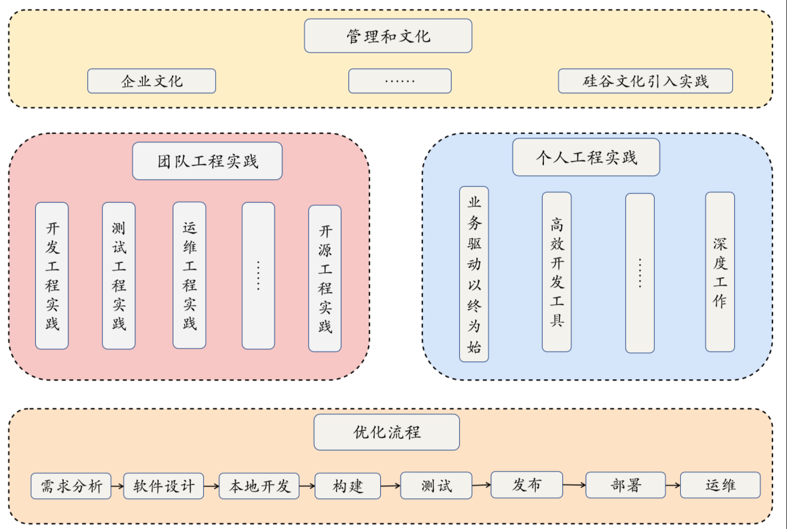
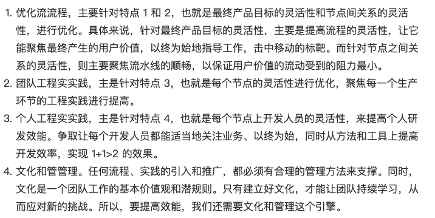

# 效率提升

线上环境有Bug，如何通过测试环境复现Bug场景呢？

**研发效能的提高，需要整个公司在研发流程、工程方法、个人效能和文化管理等方面进行精心设计。**

http://www.ruanyifeng.com/blog/2018/12/git-bisect.html

工程效率部门

## 个人效能

### 设计模式

设计模式 https://book.douban.com/subject/1052241/

业务应用架构模式 https://book.douban.com/subject/1230559/

脚手架

### 代码检查

静态扫描、相关单元测试的方便运行，以及 IDE 能够进行的实时检查等

## 总结

