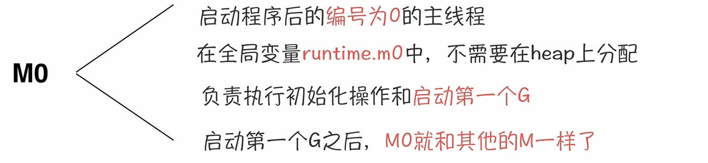

# GMP调度模型

## 1. CPU调度器

### 1. 时间切换

### 2. 系统调用

**CPU时间的浪费**

就是 上下文切换，上下文切换就会有拷贝复制，就需要CPU计算。

## 2. GMP的由来

### 1. Coroutine 协程

### 2. GMP调度架构

### 3. GMP 含义

**processor** 

- 本地G队列最多 *256* 个goroutine
- 通过 runtime.GOMAXPROCESS 可以设置 processer 的个数

### 4. GMP调度策略

- 复用线程
  - work stealing   （偷取机制）
  - hand off 机制   （分手机制）

- 利用并行
  - runtime.GOMAXPROCESS 设置利用并行的个数
- 抢占
  - 每个 *goroutine* 最多运行100ms，超过100ms 就要被其它 *goroutine* 运行
- 全局G队列
  - 加锁
  - 解锁

## 3. 调度器的生命周期

### 1. M0

### 2. G0

## GMP模型中 goroutine有哪几种状态？

## 参考

https://www.bilibili.com/video/BV19r4y1w7Nx?p=2&spm_id_from=pageDriver

https://www.kancloud.cn/aceld/golang/1958305