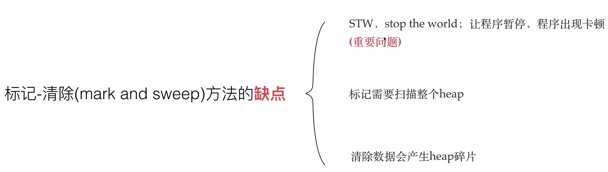
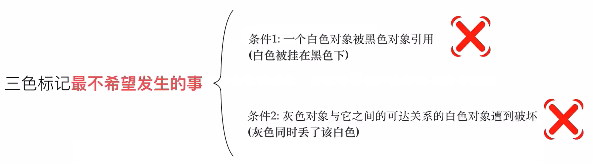

# GC回收

> 自动进行垃圾回收

GC: garbage collection

- 垃圾回收
- 内存管理
- 自动释放
- 三色标记法
- STW (stop the world)

### 1. 标记 和 清除

> Go v1.3版本之前，采用的GC回收算法

标记: Mark

清除: Sweep

#### 1. 标记 和 清除的流程

- 首先，执行STW，暂停/ 停止整个应用程序；
- 其次，进入 标记 Mark 阶段，以 main 函数为入口，被 main函数 引用的对象打上标记；
- 然后，进入 清除 Sweep 阶段，没有被标记的就会被 **GC** 回收掉；
- 最后，结束STW，整个应用程序继续运行；

#### 2. 缺点

由于 标记 和 清除 算法中，STW 暂停时间会影响程序的性能，因此引入了 三色标记法；

### 2. 三色标记法

> Go v1.5版本 三色标记法
>
> 在程序运行中，为对象标记不同的颜色，然后进行清除；

白色/灰色/黑色，三种颜色来标记对象的存活；

- 白色：初始状态
- 灰色：过渡状态，从白色 到 黑色的状态过程
- 黑色：保留的对象

#### 1. 三色标记法 流程

- 第一步，新创建的对象，默认颜色都标记为 “白色”；
- 第二步，每次GC回收开始，遍历所有的的对象，把遍历的对象从 白色 集合放入到 灰色 集合；
- 第三步，遍历所有的 灰色 集合，将灰色对象引入的对象从 白色 集合放入到 灰色 集合，之后将所有 灰色 对象放入到 黑色对象中；
- 第四步，重复 `第三步`，直到 灰色 集合中无任何对象；
- 第五步，回收 白色 集合中所有的对象，也就是垃圾回收；

#### 2. 缺点

三色标记法 也需要 *STW* 保护全部过程，依然会有性能瓶颈。

**如果三色标记 不用 STW 保护，会有什么事情发生呢？**

会存在对象丢失的问题，如下图

如果使用 三色标记 时，又不 执行 STW 呢？

- 强三色不变式，破坏条件1
- 弱三色不变式，破坏条件2

### 3. 屏障机制

#### 1. 插入写屏障

> 强三色不变式

##### 1. 流程

当一个 对象A 引入另外一个 对象B 时，强制把下游 对象B  标记 灰色对象；

##### 2. 缺点

结束时，需要 *STW* 重新扫描栈，大约需要 10 ～100ms

#### 2. 删除写屏障

> 弱三色不变式

##### 1. 流程

当一个 对象A 的下游是 一个 对象B 时，不管对象B是灰色还是白色，强制把下游 对象B  标记 灰色对象；

##### 2. 缺点

回收精度低，被删除的对象，要在下一轮才能被 GC清理掉；

### 4. 混合写屏障

为什么又引入了 混合写屏障？最关键的问题是在GC回收时不执行STW。

#### 1. 流程

> 满足变形的弱三色不变式，结合插入 和 删除 写屏障的优点。

- 第一步，GC一开始，全部扫描栈上所有对象并标记为黑色；（目的不进行第二次重复扫描，无需STW）
- 第二步，GC期间，任何在栈上创建的新对象均标记为 黑色；
- 第三步，被删除的对象标记为灰色，
- 第四步，被添加的对象标记为灰色，

## 参考

https://www.bilibili.com/video/BV1wz4y1y7Kd?from=search&seid=1958874065992742181

kancloud.cn/aceld/golang/1958308

