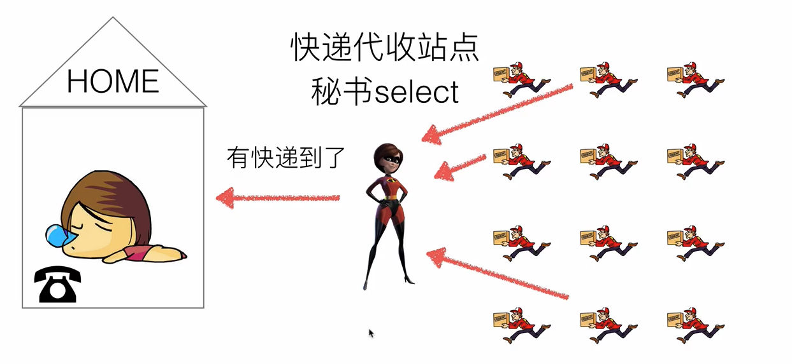
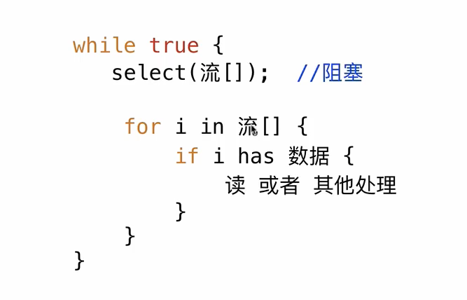
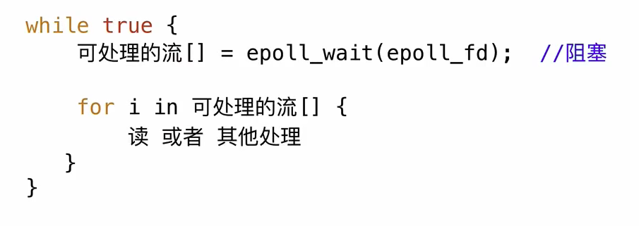

# IO 多路复用

## 阻塞
> 不占用 CPU 时间

```go
for {
    conn.read() // 如果没数据就一直堵塞
}
```

## 非阻塞

```go
for {
    if data := conn.read(); data != nil {
        // send(data)
    }
    // do something
}
```

## 多路IO

特性
- 阻塞等待，不浪费CPU时间
- 同一时刻能够监听多个IO请求的状态

### 实现方式

#### 阻塞 + 多进程/多线程
资源成本高，创建和切换

##### select
> 最多监听 1024 个流的状态


- select 的工作原理



- select 伪代码



##### epoll

> 不受 1024 个流的限制

- epoll 的工作原理


- epoll 的伪代码




## 参考

https://www.bilibili.com/video/BV1jK4y1N7ST?p=1

