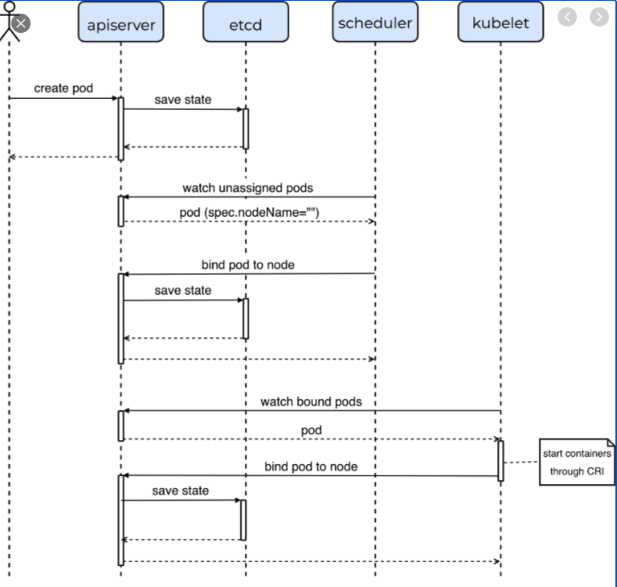
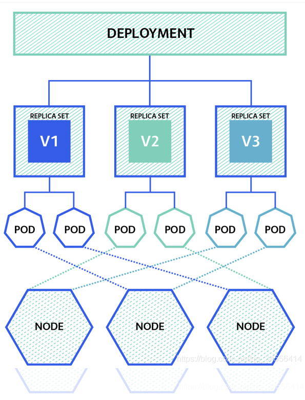
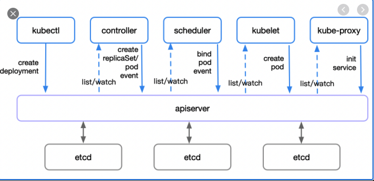
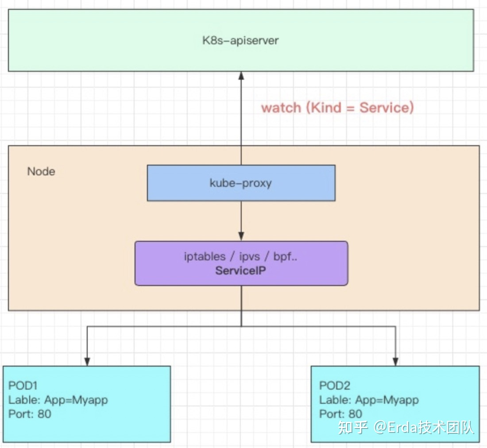
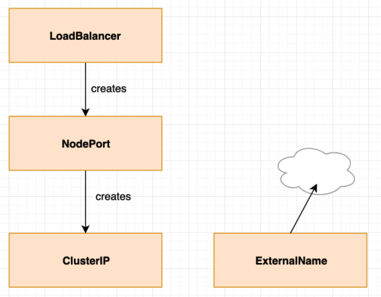

# Kubernetes

## 1. 集群故障如何快速恢复

集群中所有的持久数据是存储在*Etcd cluster*中，只要保证Etcd cluster有备份，即可快速恢复。

## 2. Pod的Pause容器

pause容器来作为一个pod中所有容器的父容器

- 它提供整个pod的Linux命名空间的基础
- 启用PID命名空间，它在每个pod中都作为PID为1进程，并回收僵尸进程。

参考

https://zhuanlan.zhihu.com/p/81666226

https://www.toutiao.com/i6720871917500236296/?group_id=6720871917500236296&wid=1622345791742

## 3. Pod下哪些资源是共享的

同一个Pod中不同的Container， 网络(Net namespace)，存储(int namespace)是共享的。

## 4. Kubelet启动Pod运行时的顺序

CRI/ CNI/ CSI

- CRI：Container Runtime Interface

- CNI: Container Network Interface

- CSI: Container Storage Interface

如果按照 *pause* 容器的顺序来看：CRI -> CSI -> CNI

如果按照 *业务容器* 顺序来看：CSI -> CRI - > CNI

## 5. Pod创建的全过程

https://blog.csdn.net/yan234280533/article/details/72567261

## 6. Deployment创建的全过程

https://blog.csdn.net/YoungAngelGirl/article/details/80031904

## 7. kube-proxy 和 service 工作机制

从kubernetes-apiserver去获取service的信息，然后部署在每个node节点上的kube-proxy组件来创建对应的**负载均衡策略，**实现pod的负载均衡。

**service**

有四种Type，支持四层负载均衡的能力

- ClusterIP，即 VIP 虚拟IP， 默认仅Host Only网络可通。
- NodePort
- LoadBalance
- ExternalName

**kube-proxy**

以 DaemonSet 的方式部署，真正提供四层负载均衡的能力，在内核态完成转发；

DNAT的方式

Kube-proxy默认会在所有的Node节点上运行，并创建这个VIP实现负载均衡；

有三个版本

- userspace
- iptables 
  - 基于链表的方式实现，线性查找时间复杂度O(N)，当规模非常大时，查找和处理的开销就特别大
- ipvs 
  - hash查找，O(1)复杂度性； 
  - 支持数十种调度算法

Haproxy, Nginx 都是在用户态转发，性能必然没有在内核态效率高。

参考

Kube-proxy https://zhuanlan.zhihu.com/p/94418251

service https://zhuanlan.zhihu.com/p/157565821

