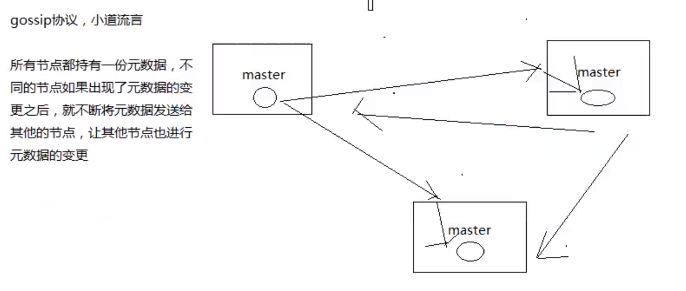
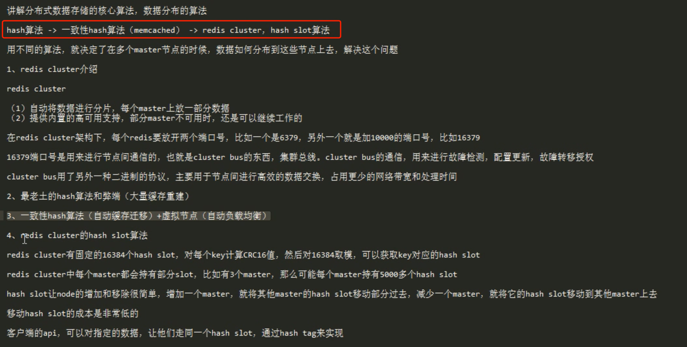
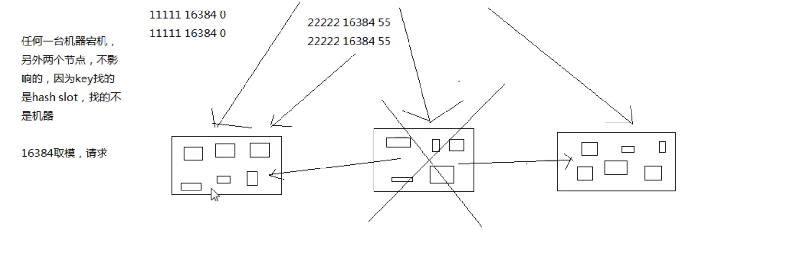

# Redis

## redis 数据类型
- str
- list
- set 无序集合
- sort set 有序集合
- hash hash散列值

## redis 持久化机制
RDB  
AOF

## redis cluster

### Raft
Leader选举 和 日志复制

### Gossip

元数据是指 以Redis为栗

- 节点和Hash slot的映射关系
- Master和Slave的映射关系
- 节点的各种状态

## 场景对比replication 和 cluster

**replication**

如果数据量很少，比如几个G，主要用在高并发高性能的场景，单机模式就够啦

一个Master，多个Slave，然后自已搭建一个sentinal集群，去保证redis 主从模式高可用就可以啦。

**cluster**

主要针对**海量数据**，高并发，高性能的场景。

## redis 主从怎么做的数据一致

## redis分布式数据存储算法

### hash slot算法

## redis 淘汰机制

https://www.cnblogs.com/smallzhen/p/12728455.html

## redis为什么那么快

## 参考

[redis cluster集群模式原理](https://www.bilibili.com/video/BV1aE411o77n?p=1)