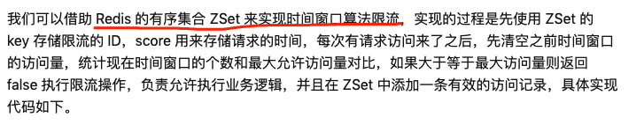

# 服务治理

[TOC]

## 概述

**目标**：保证服务24小时不间断运行；

**一个合格的服务治理系统是什么样子的**：不仅要及时的反馈业务当时的健康情况，更重要的是在发生状况时，及时通知以及故障的根源，并让SRE快速止损；

## 故障

### 故障分类

- 软硬件故障，比如硬盘坏掉，网线不通，断电等；
- <u>软硬件升级 与 各类配置变更，比如发布；</u> 最为频繁
- 终端用户的请求

## 提高容错性的方案

### 隔离

隔离有两种机制

- 线程池
- 信号量

### 限流

> 限流是从系统的流量入口考虑，从进入的流量上进行限制，达到保护系统的作用；

#### 限流分类

- 客户端限流
- Nginx限流
- 服务端限流

##### 1. Nginx限流

有两种方式

方式1: 限制单个IP最多连接数

##### 2. 服务端限流

从算法角度来看，限流算法可分为三种

- 漏桶算法
- 令牌桶算法
- 滑动时间窗口算法

###### 1. 漏桶算法

###### 2. 令牌桶算法

###### 3. 滑动时间窗口算法

### 过载保护

**过载**： 

因为活跃的用户超过了资源承受能力范围，导致某类资源耗尽，进而体现出系统过载；

### 熔断

### 降级

降级，是从系统内部的平级服务或者业务的维度考虑，流量大了，可以干掉一些，保护其他正常使用；

### 重试

### 负载均衡

### 监控

> 监控依赖与日志

- 监控的覆盖率
- 报警
  - 准确度，减少误报
  - 报警信息足够完整，直指根因
- 监控项
  - 延迟
  - 状态码
  - 

### 预案

- 无状态

  - 流量调度层 切换；
  - DNS 解析

- 有状态

  - > 比如数据库

  - 通过过载保护的机制对服务进行降级，扔掉一部分用户对请求流量；

  - 集群扩容

google dapper

open tracing

### **保证稳定性

- 做好足够的容量规划，需要伴随着性能反复的测试，直到性能负载达到失败的程度；
- 网关层来做控制，控制API的QPS
- 服务端控制
  - 通过机器的整体负载来保护自已；
  - 服务优雅降级，触发分支语句；可以根据请求类型 和 重要程度来区分；
- 客户端控制
  - 如果错误，减慢请求的次数
  - 设置合理的超时时间

## 链路监控

https://www.jianshu.com/p/07a00d66e703

https://www.sohu.com/a/439026174_411876

https://www.jianshu.com/p/4fa81b661f55

比较 https://www.sohu.com/a/361349657_468635

中文 https://github.com/skyao/learning-pinpoint/blob/master/design/technical_overview.md

## 参考

文章

https://zhuanlan.zhihu.com/p/61363959

https://xie.infoq.cn/article/2593d1a3b9e1e06cac6502c4f

https://github.com/chenqingyun/all-in-java/blob/master/note/%E5%88%86%E5%B8%83%E5%BC%8F%E6%9C%8D%E5%8A%A1%E6%A1%86%E6%9E%B6%E5%92%8C%E4%B8%AD%E9%97%B4%E4%BB%B6/%E6%9C%8D%E5%8A%A1%E9%9B%AA%E5%B4%A9%E3%80%81%E7%86%94%E6%96%AD%E3%80%81%E9%99%8D%E7%BA%A7%E5%92%8C%E9%99%90%E6%B5%81.md

https://segmentfault.com/a/1190000020791119

视频

https://www.bilibili.com/video/BV16E411d7rf

[高可用架构设计与实践@孙玄@](https://www.bilibili.com/video/BV1qJ411C7PH/?spm_id_from=333.788.recommend_more_video.7)

